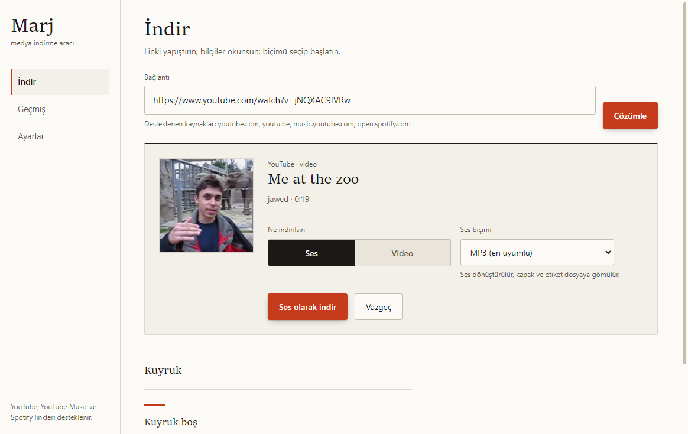

# Marj

YouTube, YouTube Music ve Spotify linklerinden ses dosyası veya video indiren
mini masaüstü aracı. Tek pencere, tek alan: linki yapıştır, analiz et, indir.



## Özellikler

- **YouTube / YouTube Music**: video veya ses (MP3, M4A, Opus, kaynak biçim)
  olarak indirir; kapak görseli ve etiketler dosyaya gömülür.
- **Spotify**: parça, albüm ve çalma listesi linklerini okur; parçaları
  YouTube'da bularak tek iş halinde sıraya alır.
- **Kuyruk**: sırayla çalışır; her satır Bekliyor, İndiriliyor, Tamamlandı,
  Hata veya İptal durumundadır. Çalışan iş iptal edilir, hata tekrar
  denenebilir.
- **Geçmiş kalıcıdır**: dosyayı klasörde açmak satırdaki düğme yeterlidir.
- **Açık / koyu tema**, dar ekranda taşmasız düzen, klavyeyle tam kullanım.
- **Ayarlar**: indirme klasörü, dosya adı şablonu, eşzamanlı indirme sayısı,
  yaş sınırlı içerik için çerez, tema.

## Kurulum ve çalıştırma

Gereksinim: Node.js 20+ (yalnızca geliştirme ve test için).

```powershell
npm install
npm start
```

## Paketler

### Windows

```powershell
npm run dist:win
```

| Çıktı | Açıklama |
| --- | --- |
| `dist/Marj-Setup-1.0.0-x64.exe` | NSIS kurucusu (kurulum sihirbazı) |
| `dist/Marj-Portable-1.0.0-x64.exe` | Kurulum gerektirmeyen taşınabilir sürüm |

### Debian / Ubuntu

`.deb` yalnızca Linux üzerinde üretilebilir (electron-builder `fpm`
delegasyonu Linux gerektirir):

```sh
npm install
npm run dist:linux:deb
sudo apt install ./dist/marj_1.0.0_amd64.deb
```

### Arch Linux

electron-builder ile:

```sh
npm install
npm run dist:linux:pacman
```

Veya repodaki `PKGBUILD` ile:

```sh
makepkg -si
```

### Diğer Linux hedefleri

```sh
npm run dist:linux    # deb + pacman + AppImage
```

## İndirme motoru

Marj [yt-dlp](https://github.com/yt-dlp/yt-dlp) ile indirir ve
[FFmpeg](https://ffmpeg.org/) ile dönüştürür.

- İlk açılışta `PATH` üzerinde aranır, bulunamazsa Ayarlar üzerinden elle
  seçilebilir.
- `yt-dlp` gerekirse uygulama içinden kendiliğinden indirilir.
- MP3 çıkışı için FFmpeg gerekir; yoksa uygulama hata vermek yerine ses
  biçiminde indirir ve bunu arayüzde açıkça yazar.

Kurulum önerileri:

- Windows: `winget install yt-dlp` ve `winget install Gyan.FFmpeg`
- Debian/Ubuntu: `sudo apt install ffmpeg` ve `pipx install yt-dlp`
- Arch: `sudo pacman -S ffmpeg yt-dlp`

## Test

Arayüz testi Playwright ile gerçek Electron penceresini açar, gerçekten
tıklayıp indirme yapar ve ekran görüntülerini üretir:

```powershell
npm run test:ui
```

Kapsam (49 kontrol): boş / yükleniyor / hata durumları, klavye odak halkası,
açık ve koyu tema kontrastı, 430px genişlikte taşma, araç kurulumu, gerçek
YouTube ve Spotify analizi, MP3 indirme ve dosya doğrulama, Spotify çalma
listesinin tek işte toplu kuyruğa alınması, iş iptali, uygulama kapanırken
kesilen işin "kesildi" olarak işaretlenip tekrar denemesi, ayarların geri
alınması, konsol hatası denetimi.

Çıktılar: `screenshots/*.png` ve `screenshots/report.json`.

## Proje yapısı

```
electron/    pencere, ayarlar, kuyruk, yt-dlp motoru (saf Node, üretim bağımlılığı yok)
renderer/    HTML + CSS + JS arayüz (framework yok, build adımı yok)
scripts/     ikon üretimi, arayüz testi, stil doğrulaması, paketleme yardımcıları
DESIGN.md    tasarım yönü, palet, tipografi, gerekçeler
DELIVERY-GATE.md  teslim öncesi denetim raporu
```

Tasarım kararı gerekçeleri `DESIGN.md` dosyasında; teslim öncesi kontrol
listesi `DELIVERY-GATE.md` dosyasındadır.

## Sorumluluk

İndirdiğin içeriklerin telif ve kullanım hakları sana aittir. Telifli eserleri
yalnızca hakların olduğun durumlarda indir. Marj üçüncü taraf hizmetlerle
(resmi API'ler yerine herkese açık sayfalarla) çalışır; hizmet koşulları
değişebilir.

## Lisans

MIT. Bakınız [LICENSE](LICENSE).
